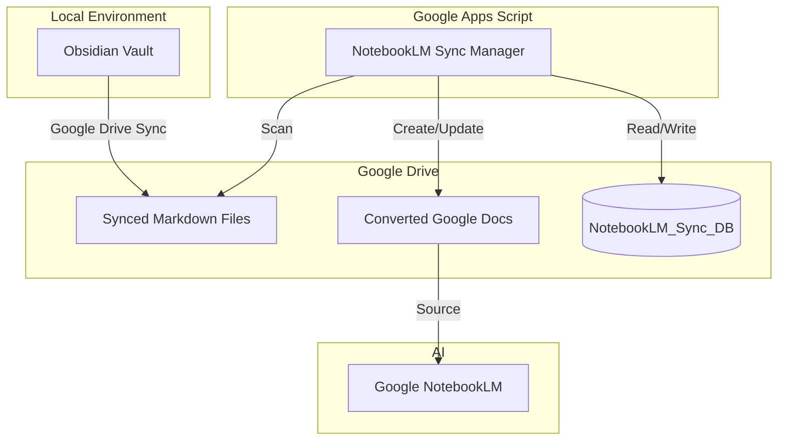

# NotebookLM Sync Manager


**NotebookLM Sync Manager** は、**Obsidian**（ローカルナレッジベース）と **Google NotebookLM** の間を橋渡しするために設計された Google Apps Script (GAS) ツールです。

Googleドライブに同期されたローカルのMarkdownファイルを自動的にGoogleドキュメント形式に変換・同期し、NotebookLMがソースとして読み込めるようにします。

## 🚀 概要 (Overview)

NotebookLMは強力なAIリサーチアシスタントですが、Googleドキュメントやスライドとの連携に最適化されています。テキストファイルのアップロードも可能ですが、日々成長するObsidianボルトの更新を手動で管理するのは非常に手間（トイル）がかかります。

本ツールはこのパイプラインを自動化します：
1.  Obsidianボルト（Drive同期済み）をスキャン。
2.  MarkdownファイルをGoogleドキュメントに変換。
3.  変更があったファイルのみを更新し、同期状態を維持。

## ✨ 特徴 (Features)

-   **スタンドアロン動作**: スクリプト単体で動作し、独自のデータベース（スプレッドシート）で管理します。
-   **差分更新 (Differential Sync)**: タイムスタンプ（`Last Updated`）を確認し、変更されたファイルのみを同期することで、API割り当てと時間を節約します。
-   **状態維持 (State Preservation)**: フォルダを再スキャンしても、同期設定（`Sync?` フラグ）を維持します。
-   **自動セットアップ**: ワンクリック初期化（`setupSystem`）により、必要なデータベースとフォルダ構成を自動的に作成します。
-   **再帰スキャン**: Obsidianボルトの深いフォルダ構造もそのまま反映してスキャンします。
-   **クリーンなファイル名**: Googleドキュメント作成時に拡張子 (`.md`) を自動的に除去し、視認性を向上させます。

## 🏗️ アーキテクチャ (Architecture)



## 🛠️ セットアップ (Setup)

### 前提条件
-   Node.js & npm がインストールされていること
-   `clasp` がグローバルインストールされていること (`npm i @google/clasp -g`)
-   Google アカウント

### インストール手順

1.  **リポジトリのクローン**
    ```bash
    git clone https://github.com/your-username/notebooklm-sync-manager.git
    cd notebooklm-sync-manager
    ```

2.  **Googleログイン**
    ```bash
    clasp login
    ```

3.  **コードのプッシュ**
    ```bash
    clasp push
    ```

4.  **初回セットアップ**
    - ブラウザでスクリプトを開きます：
        ```bash
        clasp open
        ```
    - エディタの関数リストから `setupSystem` を実行します。
    - **注意**: これにより `NotebookLM_Sync_DB` という名前のスプレッドシートが作成され、設定されたターゲットフォルダに移動されます。
    - 「実行ログ」を確認し、作成されたスプレッドシートのURLをチェックしてください。

## 📖 使い方 (Usage)

### 1. 設定 (Configure Settings)
生成されたスプレッドシート（`NotebookLM_Sync_DB`）を開き、**Settings** シートに移動します。

| Memo | Source_Folder_URL | Target_Folder_URL | Recursive? |
| :--- | :--- | :--- | :--- |
| My Project | `https://drive.google.com/...` (MDファイル格納先) | `https://drive.google.com/...` (出力先) | `TRUE` |

### 2. リスト更新 (Update List)
スクリプトエディタ（またはバインド時のカスタムメニュー）から：
-   **`scanTargetFolder`** を実行します。
-   **Console** シートに、見つかったMarkdownファイルがリストアップされます。

### 3. 同期対象の選択 (Select Files to Sync)
**Console** シートにて：
-   同期したいファイルの **`Sync?`** 列にチェックを入れます。
-   （新規ファイルはデフォルトでチェックが外れています）。

### 4. 同期実行 (Run Sync)
スクリプトエディタから：
-   **`syncFiles`** を実行します。
-   `Last_Updated_MD` > `Last_Sync_Time` （更新あり）かつチェックが入っているファイルのみ処理されます。
-   `Last_Updated_MD` > `Last_Sync_Time` （更新あり）かつチェックが入っているファイルのみ処理されます。
-   **Status** 列で結果を確認できます（`Synced`, `Skipped`, `Error`）。

### 5. ファイル名修正 (Fix Filenames)
既に同期済みのファイル名に `.md` が残っている場合：
-   スクリプトエディタまたはメニューから **`fixFilenames`** を実行します。
-   Googleドキュメントの名前から拡張子を除去してリネームします。

## 📄 ライセンス (License)

本プロジェクトは MIT License の下で公開されています。詳細は [LICENSE](LICENSE) ファイルをご確認ください。

## 👤 作者 (Author)

**後藤 柳次郎**
